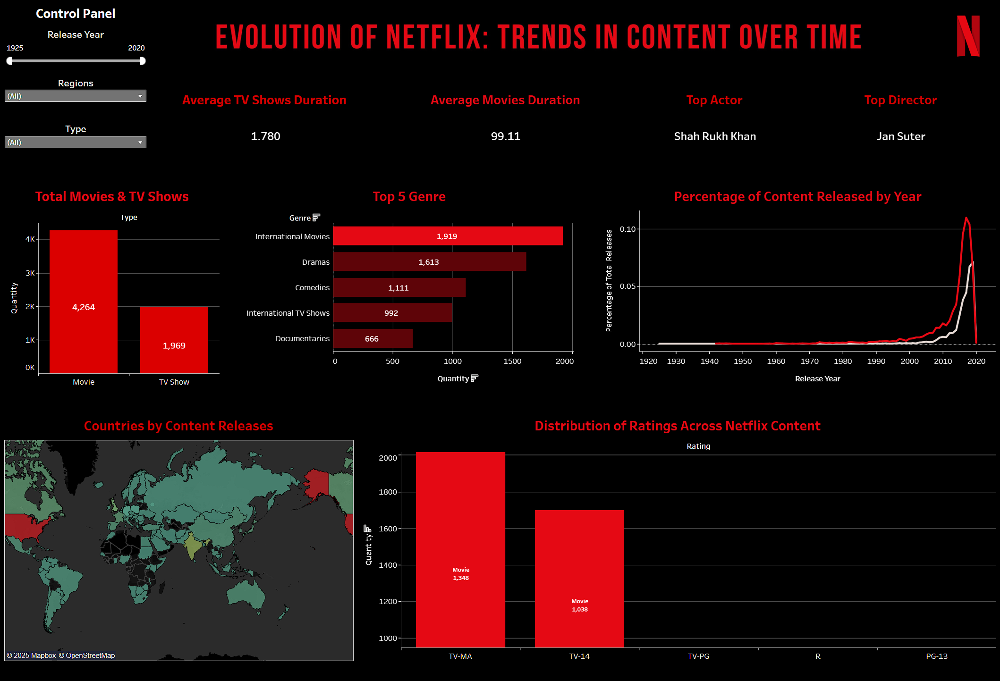

# 📺 Evolution of Netflix: Trends in Content Over Time

Welcome to my personal data visualization project exploring the evolution of Netflix content across time, regions, and genres.

## 📊 Project Overview

In this project, I designed and built an interactive dashboard using **Tableau** to explore and communicate insights about Netflix’s vast and ever-evolving content library. This includes analysis of TV shows and movies over the years, with key metrics such as:

- Average duration of TV Shows and Movies
- Top Actor and Director based on filters
- Content breakdown: Movies vs TV Shows
- Top 5 genres over time
- Yearly content release percentage by type
- Geographical distribution of Netflix content
- Content rating distribution

## 🧠 What I Learned

This project was a valuable opportunity to:

- Practice **creative thinking** in presenting complex data visually.
- Apply a **user-centered design** mindset to make dashboards intuitive and friendly for non-technical audiences.
- Enhance my **public speaking and communication skills** through direct presentation to viewers.

## 📌 Tools Used

- **Tableau**: For interactive data visualization
- **Excel / CSV**: For preprocessing Netflix content data
- **GitHub**: To version control and share this project

## 📷 Dashboard Preview

## 🚀 How to Use

1. Open the `.twbx` Tableau Workbook file.
2. Explore filters such as:
   - **Release Year**
   - **Region**
   - **Type (Movie or TV Show)**
3. Navigate through each chart to gain deeper insights into Netflix content trends.

---

Thank you for visiting this project! 😊

